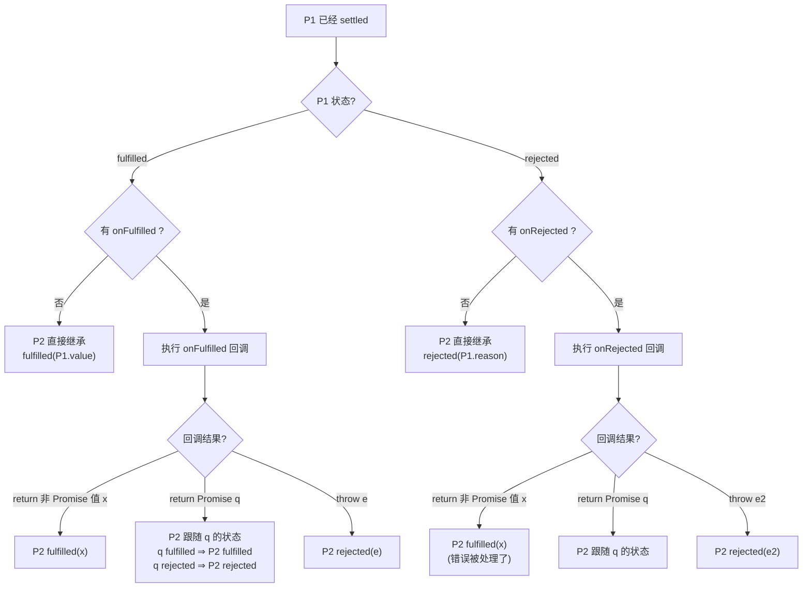
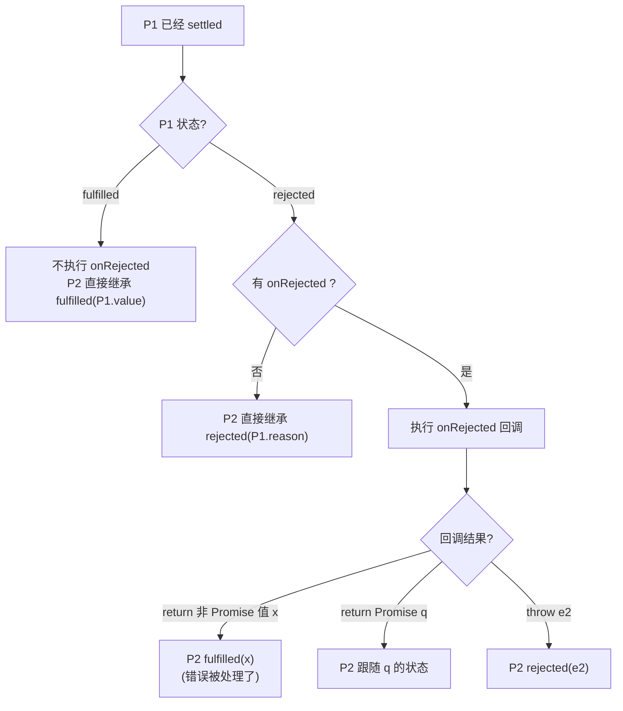
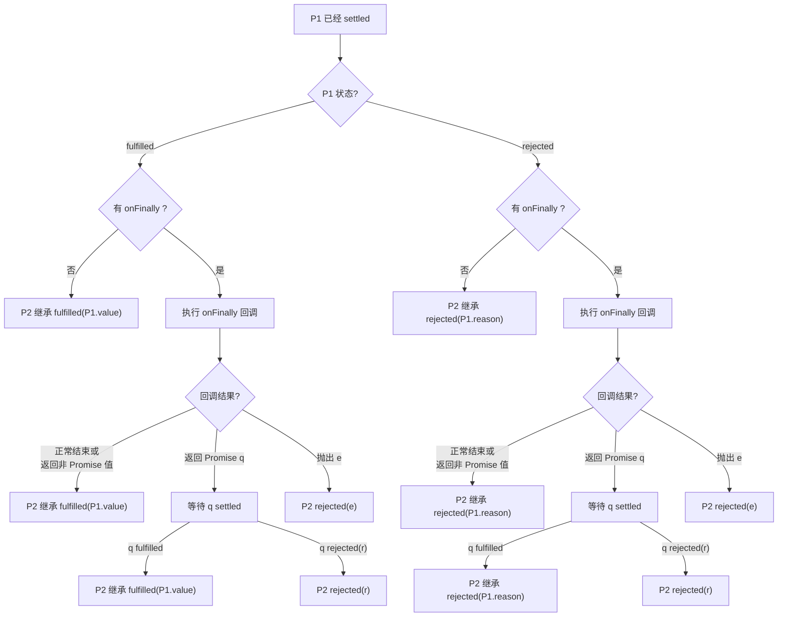

# Promise

## Promise 状态传递

### then

```mermaid
flowchart TD
  A["P1 已经 settled"] --> B{"P1 状态?"}

  B -->|"fulfilled"| C{"有 onFulfilled ?"}
  B -->|"rejected"| J{"有 onRejected ?"}

  %% fulfilled 分支
  C -->|"否"| F["P2 直接继承<br/>fulfilled(P1.value)"]
  C -->|"是"| D["执行 onFulfilled 回调"]

  D --> M{"回调结果?"}
  M -->|"return 非 Promise 值 x"| F2["P2 fulfilled(x)"]
  M -->|"return Promise q"| G["P2 跟随 q 的状态<br/>q fulfilled ⇒ P2 fulfilled<br/>q rejected ⇒ P2 rejected"]
  M -->|"throw e"| H["P2 rejected(e)"]

  %% rejected 分支
  J -->|"否"| K["P2 直接继承<br/>rejected(P1.reason)"]
  J -->|"是"| L["执行 onRejected 回调"]

  L --> N{"回调结果?"}
  N -->|"return 非 Promise 值 x"| F3["P2 fulfilled(x)<br/>(错误被处理了)"]
  N -->|"return Promise q"| G2["P2 跟随 q 的状态"]
  N -->|"throw e2"| H2["P2 rejected(e2)"]
```

### catch

```mermaid
flowchart TD
  A["P1 已经 settled"] --> B{"P1 状态?"}

  B -->|"fulfilled"| C["不执行 onRejected<br>P2 直接继承 fulfilled(P1.value)"]
  B -->|"rejected"| D{"有 onRejected ?"}

  D -->|"否"| E["P2 直接继承 rejected(P1.reason)"]
  D -->|"是"| F["执行 onRejected 回调"]

  F --> G{"回调结果?"}
  G -->|"return 非 Promise 值 x"| H["P2 fulfilled(x)<br>(错误被处理了)"]
  G -->|"return Promise q"| I["P2 跟随 q 的状态"]
  G -->|"throw e2"| J["P2 rejected(e2)"]
```

### finally

```mermaid
flowchart TD
  A["P1 已经 settled"] --> B{"P1 状态?"}

  B -->|"fulfilled"| C{"有 onFinally ?"}
  B -->|"rejected"| J{"有 onFinally ?"}

  C -->|"否"| D["P2 继承 fulfilled(P1.value)"]
  C -->|"是"| E["执行 onFinally 回调"]

  J -->|"否"| K["P2 继承 rejected(P1.reason)"]
  J -->|"是"| L["执行 onFinally 回调"]

  E --> M{"回调结果?"}
  M -->|"正常结束或<br>返回非 Promise 值"| N["P2 继承 fulfilled(P1.value)"]
  M -->|"返回 Promise q"| O["等待 q settled"]
  O -->|"q fulfilled"| P["P2 继承 fulfilled(P1.value)"]
  O -->|"q rejected(r)"| Q["P2 rejected(r)"]
  M -->|"抛出 e"| R["P2 rejected(e)"]

  L --> S{"回调结果?"}
  S -->|"正常结束或<br>返回非 Promise 值"| T["P2 继承 rejected(P1.reason)"]
  S -->|"返回 Promise q"| U["等待 q settled"]
  U -->|"q fulfilled"| V["P2 继承 rejected(P1.reason)"]
  U -->|"q rejected(r)"| W["P2 rejected(r)"]
  S -->|"抛出 e"| X["P2 rejected(e)"]
```
