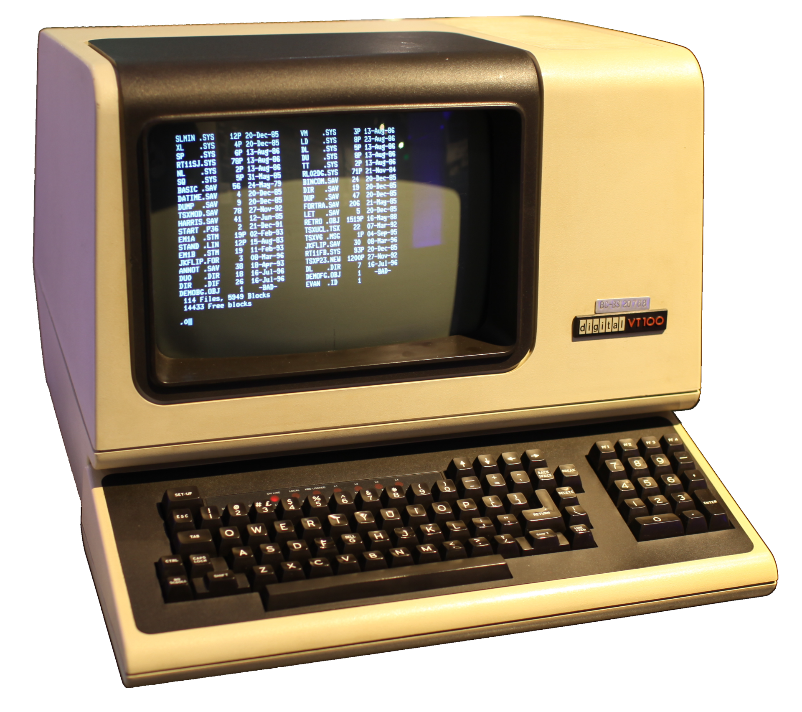

## 输入输出设备的发展

### Punch Card 穿孔卡片

在计算机发展的初期，特别是 20 世纪 40 年代和 50 年代，数据主要是通过 穿孔卡片（Punch Card）或磁带输入计算机。这些方法在当时是唯一的输入输出手段，但它们非常笨重、缓慢且容易出错。穿孔卡片通过物理打孔的方式存储数据，每张卡片代表一个程序或一条数据记录。用户将这些卡片送入计算机进行读取和处理。

然而，这些设备并不是传统意义上的“终端”，因为它们并不允许实时交互。用户与计算机的交互通常是通过专业人员进行的，计算机并没有为普通用户设计的直接交互设备。穿孔卡片的使用限制了计算机的实时应用，尤其在处理大量数据时，它的效率非常低。

### Teletypewriter 电传打字机

到了 1950 年代末期至 60 年代，电传打字机（Teletypewriter，简称 TTY）成为了计算机交互式输入输出设备的主要形式。电传打字机最初是为了电报通信而设计的，后来被改造用于计算机交互。它使得用户能够与计算机进行实时交互，是计算机历史上的一项重要进步。

电传打字机的主要组成部分包括：

- 键盘：用于输入命令和数据。
- 打印机：用于将计算机的响应打印在纸张或纸带上，形成永久记录。
- 纸带阅读器/打孔器：用于读取纸带上存储的信息，或者打孔以创建新的纸带程序。

其具有以下特点：

- 交互方式：允许用户直接键入命令并接收文本形式的响应，实现了实时交互。
- 输出形式：通过打印机将计算机的响应打印在纸张上，形成永久记录，虽然速度较慢，但这种方式对数据记录和处理提供了可行的解决方案。
- 通信协议：使用串行通信，每次传输一个字符，采用 ASCII 编码，即字符集中的每个字符都对应一个特定的数字。
- 速度限制：典型的传输速度为每秒 10 个字符（即 110 波特），远远低于现代计算机的速度，但对于当时的技术环境来说，它是一种有效的交互方式。

电传打字机为后来的计算机终端奠定了基础，许多现代终端的概念和命令（如 CR（回车）、LF（换行）、BEL（响铃）等）都源自这一时期。Unix 系统中的 TTY 驱动程序 就是以电传打字机命名的，这反映了其在计算机发展中的历史重要性。

https://www.bilibili.com/video/BV1bs411M7oe/?spm_id_from=333.337.search-card.all.click&vd_source=5ef1597400e55d307f86d9eca7262dff

### Video Display Terminal 视频显示终端

随着显示器技术的进步，视频显示终端（Video Display Terminal, VDT）在 1970 年代出现，它采用 CRT（阴极射线管）屏幕 代替了传统的打印机制，提供了更快速的输入输出方式。视频显示终端允许用户实时查看输入的内容，极大地提高了交互效率，并标志着计算机用户界面的一个重要转折点。

视频显示终端通常配备了 键盘 和 显示屏，用户可以通过键盘输入命令，屏幕则实时显示计算机的响应。这种交互方式不仅加快了数据处理速度，还使得编程和数据分析变得更加直观和高效。与早期依赖纸张输出的设备相比，VDT 让用户不再依赖纸张记录，而是能够通过屏幕直接查看计算机的反馈，极大地提高了效率。

视频显示终端的出现，尤其是在大型计算机和早期个人计算机中，推动了计算机图形界面的发展。VDT 支持多种 字符集 和 图形显示，进一步丰富了用户的操作体验。随着 彩色显示 和 高分辨率显示器 的普及，视频显示终端逐渐过渡到现代的 计算机显示器。

---

然而，这些物理终端随着图形用户界面的普及，逐渐被取代。

## Virtual Terminal 虚拟终端

虚拟终端是操作系统提供的一种抽象概念，它是基于操作系统内核的功能实现的。虚拟终端允许用户在一个物理终端设备（如计算机的显示器和键盘）上创建多个逻辑终端会话。例如，在 Linux 系统中，用户可以通过组合键（如 Ctrl + Alt + F1 - F6 等）切换到不同的虚拟终端，每个虚拟终端就像是一个独立的终端设备，可以运行不同的程序或者执行不同的任务。
