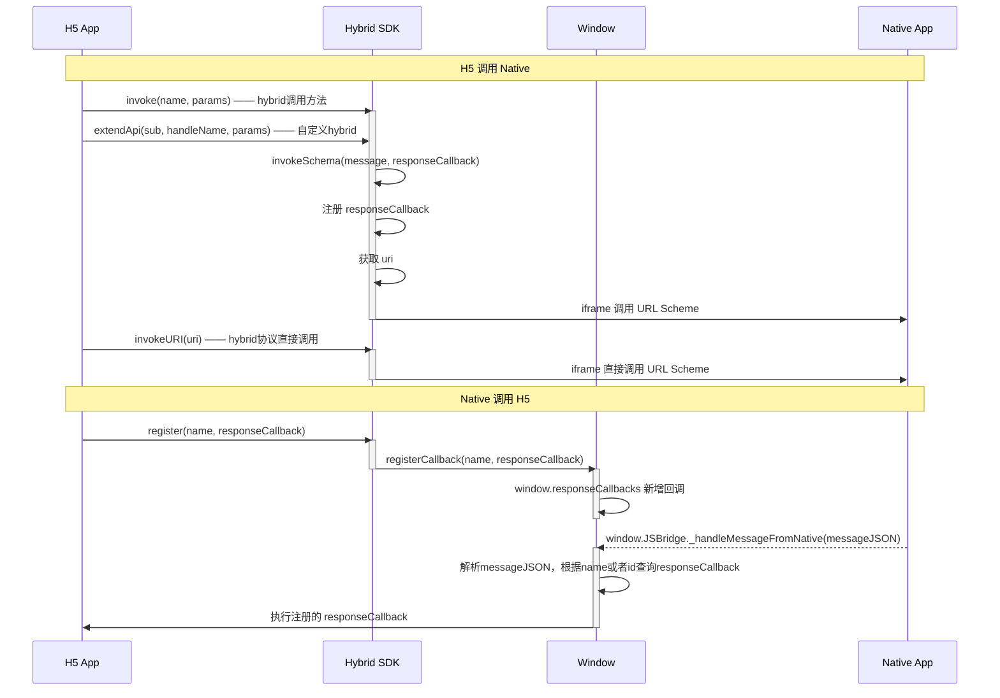

#

## Demo

```js
import { ScrollBlot, Registry } from 'parchment';
import { BlockBlot, InlineBlot, TextBlot } from 'parchment';

BlockBlot.defaultChild = TextBlot;
const registry = new Registry();
registry.register(BlockBlot, InlineBlot, TextBlot);

const editor = document.querySelector('#app');
const scroll = new ScrollBlot(registry, editor);

const block = scroll.create('block');

scroll.insertBefore(block);
scroll.insertAt(3, 'block', true);
// scroll.insertAt(3, 'World');
```



###

```js
import Hybrid from '@baidu/hybrid';

const button = document.createElement('button');
button.addEventListener('click', () => {
  Hybrid.extendApi('test', 'demo', () => {
    console.log('test');
  });
  console.log(window.responseCallbacks);
});
button.innerHTML = 'extendApi';

const button2 = document.createElement('button');
button2.innerHTML = 'register';
button2.addEventListener('click', () => {
  Hybrid.register('func1', (responseData) => {
    console.log('func1 callback', responseData);
  });
  console.log(window.responseCallbacks);
});

const button3 = document.createElement('button');
button3.innerHTML = 'handleCallback';

const callback = {
  responseName: 'func1',
  responseData: 'demo',
};

const json = JSON.stringify(callback);

button3.addEventListener('click', () => {
  console.log('json', json);
  window.JSBridge._handleMessageFromNative(
    `{"responseName":"${callback.responseName}","responseData":{"code":1,"msg":"","result":{"themeinfo": "1"}}}`
  );
});

document.body.appendChild(button);
document.body.appendChild(button2);
document.body.appendChild(button3);
```
