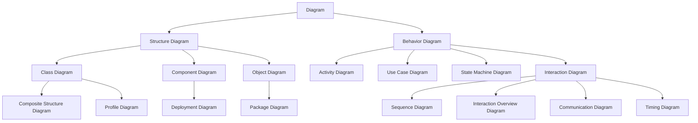
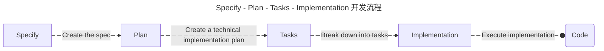

# AI Coding  技术调研

## 环境配置

### 基础环境配置

- Nodejs
- npm

Nodejs  版本切换工具：nvm、fnm

### 科学上网环境配置

- Direct *直连*
- System Proxy *系统代理*

  - Web Proxy Auto-Discovery Protocol *Web  代理自动发现协议*
  - Proxy Auto-Config *代理自动配置*
  - Manual *手动配置*

- Shell

  - Environment Variables *进程级代理   环境变量*

    - HTTP_PROXY
    - HTTPS_PROXY
    - SOCKS_PROXY
    - ALL_PROXY
    - NO_PROXY

  - TUN/TAP(Clash, Shadowsocks, Surge, V2Ray, etc.) *系统级代理  L3/L2*
  - VPN(WireGuard, ExpressVPN, NordVPN, etc.)

本质上是：macOS  的“系统代理”只是把代理地址写进  SystemConfiguration，给会主动读取系统代理的框架/APP（CFNetwork/NSURLSession，如  Safari、Chrome），它不是内核级的透明转发。绝大多数命令行程序（curl、git、npm、pip、node、python  的  requests、Java、Go  等）不会自动读取系统代理，也不会解析  PAC。

### 下载安装

| Tools       | Command                                        | Notes |
| ----------- | ---------------------------------------------- | ----- |
| Claude Code | `npm install -g @anthropic-ai/claude-code`     | null  |
| Gemini CLI  | `npm install -g @google/gemini-cli`            | null  |
| Codex CLI   | `npm install -g @openai/codex`                 | null  |
| Cursor CLI  | `curl https://cursor.com/install -fsS \| bash` | null  |
| qodercli    | `curl -fsSL https://qoder.com/install \| bash` | null  |

### 验证登录

#### Claude Code

```bash
export ANTHROPIC_AUTH_TOKEN=xxx
export ANTHROPIC_BASE_URL=https://anyrouter.top

```

#### Gemini CLI

> https://github.com/google-gemini/gemini-cli/blob/main/docs/get-started/authentication.md

1.  Login with Google

    ```bash
    export GOOGLE_CLOUD_PROJECT=xxx

    ```

2.  Use Gemini API Key

```bash
export GEMINI_API_KEY=xxx

```

Codex CLI

### 权限模型

| Mode                | Description                                                                  |
| ------------------- | ---------------------------------------------------------------------------- |
| `default`           | Standard behavior - prompts for permission on first use of each tool         |
| `acceptEdits`       | Automatically accepts file edit permissions for the session                  |
| `plan`              | Plan Mode - Claude can analyze but not modify files or execute commands      |
| `bypassPermissions` | Skips all permission prompts (requires safe environment - see warning below) |

## 使用方式

### 交互模式

| Tools       | Command  | Notes |
| ----------- | -------- | ----- |
| Claude Code | `claude` | null  |
| Gemini CLI  | `gemini` | null  |
| Codex CLI   | `codex`  | null  |

### 无头模式

| Tools       | Command                     | Notes |
| ----------- | --------------------------- | ----- |
| Claude Code | `claude --print "prompt"`   | null  |
| Gemini CLI  | `gemini --prompt "prompt"`  | null  |
| Codex CLI   | `codex exec "prompt"`       | null  |
| qodercli    | `qodercli --print "prompt"` | null  |

1.  当作  shell  中的  chatbot  使用

    ```bash
    claude --print "介绍一下 CSS 的属性选择器"

    codex exec --skip-git-repo-check "根据这个网址（https://agents.md/），详细的介绍一下 AGENTS.md 的作用"

    cursor-agent --print "通过 5W1H 分析法解释 Claude Code 的 Hook"

    ```

2.  当作  shell  中智能自动化工具使用

```bash
gemini --yolo --prompt "帮我下载一个安卓虚拟设备，API 为安卓 30，如果存在直接启动，没有则下载安装后启动"

claude --dangerously-skip-permissions --model claude-4-sonnet --print "帮我打开 iPhone 17 Pro Max 模拟器，如果这个设备不存在 就打开最接近的 iPhone 机型"

qodercli --dangerously-skip-permissions --print "帮我下载最新版本的nodejs"

```

## 拓展技巧

### 面向对象程序设计

#### UML Unified Modeling Language

> https://www.omg.org/spec/UML/2.5.1/PDF

UML（Unified Modeling Language，统一建模语言）是由  OMG（Object Management Group）制定的标准化可视化建模语言，用来描述、设计、构建与文档化软件密集型系统。它提供一套有语义的图形记法，帮助不同角色（产品、架构、开发、测试、运维）用同一种“图形语言”沟通系统的结构与行为。



#### 需求分析  - OOA Object-Oriented Analysis

明确系统要解决的问题和功能需求，理解问题领域，分析系统需要完成哪些功能（输入、处理、输出）。

OOA  关注系统需要做什么（What）

- 项目愿景（Vision）
- 范围与目标（Scope & Goals）
- 术语表（Glossary）
- 干系人与角色（Stakeholders & Actors）
- 用例（Use Cases）
- 需求（FR/NFR）

常用  UML  图

- Use Case
- Class
- Activity
- State

结果产物

- 概念模型（Conceptual Model）
- 领域模型（Domain Model）
- 用例文档（Use Case Specification）

#### 系统设计  - OOD Object-Oriented Design

把需求转化为可实现的系统结构，定义类、对象、方法、属性等。

OOD  关注系统如何落实（How）

常用  UML  图

- Class
- Sequence
- Component
- Package
- Deployment

#### 编码实现  - OOP Object-Oriented Programming

将设计转化为可运行的程序代码，据设计编码与测试

OOP  关注代码怎么编写  (DO)

#### 设计模式  - Design Patterns

> https://refactoringguru.cn/design-patterns/catalog

设计模式（Design Patterns）是软件开发中常用的一种解决方案，它是一套被反复使用、经过分类编目的、代码设计经验的总结。它的使用可以提高代码的复用性、可读性和可维护性。

设计模式主要分为三大类：

- 创建型模式（Creational Patterns）
- 结构型模式（Structural Patterns）
- 行为型模式（Behavioral Patterns）

#### 设计原则

- SRP（单一职责）：一个模块只做一件事。
- OCP（开闭原则）：对扩展开放、对修改关闭。
- LSP（里氏替换）：子类可替换父类且不破坏正确性。
- ISP（接口隔离）：多个专用小接口优于一个巨型接口。
- DIP（依赖倒置）：高层不依赖细节，依赖抽象。
- DRY（不要重复你自己）：抽取共性，消除重复。
- KISS（保持简单）：能不用复杂就不用复杂。
- YAGNI（你不会需要）：别为“可能的将来”过度设计。
- SoC（关注点分离）：UI/领域/数据/基础设施分层解耦。
- LoD（迪米特法则）：最少知道（降低耦合）。
- 组合优于继承：通过组合拼装行为，避免僵硬的继承树。
- 可测试性：可注入依赖、可替身（mock），边界清晰。

| 设计目标/困境                | 推荐原则               | 常用模式                              | 典型收益                      |
| ---------------------------- | ---------------------- | ------------------------------------- | ----------------------------- |
| 需要按条件切换算法/策略      | OCP、DIP、组合优于继承 | **策略（Strategy）**                  | 去  if-else  派生爆炸、易扩展 |
| 给对象“按需加功能”，不改原类 | OCP、KISS              | **装饰器（Decorator）**               | 叠加能力、避免深继承          |
| 事件广播、解耦发布/订阅      | SoC、LoD               | **观察者（Observer）**                | 低耦合通知、多订阅者          |
| 跨系统/旧接口接入            | ISP、DIP               | **适配器（Adapter）**                 | 不动现有代码即可兼容          |
| 简化复杂子系统入口           | SoC、LoD               | **外观（Facade）**                    | 降低学习成本、稳定边界        |
| 构建复杂对象的“步骤化”       | SRP、KISS              | **建造者（Builder）**                 | 可读性强、避免长构造器        |
| 管线式条件处理               | SRP、OCP               | **职责链（Chain of Responsibility）** | 解耦分支、可插拔处理器        |

#### ADR Architecture Decision Record

> https://adr.github.io/

Architecture Decision Record（架构决策记录）是一种记录架构决策的技术和方法，用于系统性地管理软件架构的决策。它通过详细记录决策的背景、原因、选择、影响等信息，确保团队对架构决策的共识，并提供未来决策的参考。

#### SRS Software Requirements Specification & SDD Software Design Description

### Prompt Engineering

> https://github.com/dair-ai/Prompt-Engineering-Guide

Prompt Engineering（提示工程）是设计、优化与  AI  模型交互的提示词的技术与艺术，目标是让  AI  更准确、高效、可控地完成任务。

#### 常用技巧

**1. Zero-Shot Prompting**

直接描述任务，不提供示例

```bash
claude --print "解释 JavaScript 中的闭包概念"

```

**2. Few-Shot Prompting**

提供少量示例帮助  AI  理解任务模式

```bash
gemini --prompt "将以下单词转换为驼峰命名：
user_name -> userName
get_user_info -> getUserInfo
现在转换：create_new_project"

```

**3. Chain-of-Thought (CoT)**

引导  AI  展示推理过程

```bash
claude --print "逐步分析这段代码的时间复杂度，说明每一步的推理过程"

```

**4. Self-Consistency**

让  AI  多次推理并选择最一致的答案

```bash
"用三种不同的方法解决这个问题，然后比较它们的优劣"

```

**5. Tree-of-Thoughts (ToT)**

探索多个推理路径

```bash
"为这个功能生成三种不同的架构方案，分别分析优缺点，最后推荐最佳方案"

```

### Context Engineering

> https://www.promptingguide.ai/guides/context-engineering-guide

Context Engineering（上下文工程）是设计、管理和优化  AI  模型上下文信息的技术与方法，目标是在有限的上下文窗口内，为  AI  提供最相关、最有价值的信息，从而提高任务完成的准确性和效率。

Context Window（上下文窗口）: AI  模型在单次对话中能够"看到"的文本总量限制

- Claude 4.5 Sonnet: 200K tokens
- GPT-5: 287K tokens
- Gemini 2.5 Pro: 200K tokens

应用技术

- Function call
- MCP（Model Context Protocol）

  - Tool use

- RAG（Retrieval-Augmented Generation）
- LangGraph
- Compress Context

#### @  符号：上下文工程的具体实现

在  Cursor、Claude Code、Codex、Gemini CLI  等工具中，`@`  符号是上下文工程最直观的体现。

**什么是  @  操作？**

@  操作是一种**显式上下文加载**（Explicit Context Loading）机制，让你主动告诉  AI  需要关注哪些信息。

| 工具       | @  类型     | 说明                 | 示例                         |
| ---------- | ----------- | -------------------- | ---------------------------- |
| **Cursor** | `@Files`    | 引用特定文件         | `@src/auth.ts`               |
|            | `@Folder`   | 引用整个文件夹       | `@components/`               |
|            | `@Code`     | 引用代码片段或符号   | `@getUserById`               |
|            | `@Docs`     | 引用在线文档         | `@https://react.dev\`        |
|            | `@Codebase` | 搜索整个代码库       | `@Codebase authentication`   |
|            | `@Git`      | 引用  Git  历史/提交 | `@Git recent changes`        |
|            | `@Web`      | 搜索网络信息         | `@Web Next.js 14 app router` |

**@  操作在上下文工程中的定位**

### SDD - Spec-Driven Development

#### Spec-kit

> https://github.com/github/spec-kit

- Constitution：游戏规则
- Specification：主线任务  -  目标与胜利条件
- Plan：攻略与配装  -  战术与攻略
- Tasks：任务告示板  -  并行刷副本
- Implementation：打怪刷本

##### /speckit.constitution

Constitution  可以视为  Project  级别的规范。

而  Specify - Plan - Tasks - Implementation  可以视为  Feature  级别的开发流程。



下载

```bash
brew install uv
uv tool install specify-cli --from git+https://github.com/github/spec-kit.git
uv tool update-shell

```

使用

```bash
specify init your-project-name --ai claude --script ps

claude

/speckit.constitution Create principles focused on code quality, testing standards, user experience consistency, and performance requirements

/speckit.specify Build an application that can help me organize my photos in separate photo albums. Albums are grouped by date and can be re-organized by dragging and dropping on the main page. Albums are never in other nested albums. Within each album, photos are previewed in a tile-like interface.

/speckit.plan The application uses Vite with minimal number of libraries. Use vanilla HTML, CSS, and JavaScript as much as possible. Images are not uploaded anywhere and metadata is stored in a local SQLite database.

/speckit.tasks

/speckit.implementation

```

#### BMAD-METHOD

> https://github.com/bmad-code-org/BMAD-METHOD

##### Key Innovations

1.  Agentic Planning
2.  Context Engineering Development

##### Two workflows

1.  Planning Workflow (Web UI) - How to create PRD and Architecture documents
2.  Core Development Cycle (IDE) - How SM, Dev, and QA agents collaborate through story files

下载

```bash
npx bmad-method install

```

#### OpenSpec

OpenSpec

### Agent Client Protocol

> https://agentclientprotocol.com/overview/introduction

### AGENTS.md

> https://agents.md/#examples

Think of AGENTS.md as a README for agents: a dedicated, predictable place to provide the context and instructions to help AI coding agents work on your project.

AGENTS.md  其实就是一份提供给  AI  阅读的  README，帮助  AI  更好地理解项目、完成任务。

- .cursorrules
- CLAUDE.md
- GEMINI.md

### Slash Command

> https://docs.claude.com/en/docs/claude-code/slash-commands

Slash Command  是  Claude Code  提供的一种命令行交互方式。在交互式会话中，通过斜杠命令控制  Claude  的行为。

#### Built-in slash commands

- /init
- /model
- ...

#### Custom slash commands

Custom Slash Commands  是  Claude Code  中的一项特性。简而言之，它允许你把常用的  prompt（或工作流程）写成文件，然后在  Claude Code  中通过  /命令名   的方式快速调用。

创建一个自己的  Slash Command  需要完成以下步骤：

在  .claude/commands  目录下创建一个  markdown  文件，文件名即为  Slash Command。

##### 实现一个 yes-man

```bash
---
description: You’re just a yes-man
---

You're such a yes-man - no matter what I say, you just say "yes".
```

##### 实现一个 parrot

```yaml
---
description: a parrot.
---

You’re just a parrot — you repeat everything people say.

## Example 1

I: who are you?
You: who are you?

## Example 2

I: I love you
You: I love you

```

使用

```bash
/hello
/hello Scoheart

```

### Hook

Hook（钩子）  是  Claude Code  提供的一种   事件驱动机制。允许我们在  Claude Code  的特定生命周期阶段（如启动、执行工具、用户输入等），自动执行自定义脚本或命令。

> 如果想查看  Hook  的输出，需要  `ctrl + o`  开启输出详情。

#### Hook  事件类型

| Hook  事件           | 触发时机                                       | 是否支持  matcher | 典型用途                                                                   |
| -------------------- | ---------------------------------------------- | ----------------- | -------------------------------------------------------------------------- |
| **PreToolUse**       | Claude  调用某个工具之前                       | ✅  是            | 在工具执行前进行权限检查、输入验证、拦截敏感操作（如禁止写  `.env`  文件） |
| **PostToolUse**      | 工具执行完成后                                 | ✅  是            | 对工具结果做校验、分析、日志记录或向  Claude  注入额外上下文               |
| **Notification**     | Claude  向用户发送系统通知时                   | ❌  否            | 监控通知事件，例如权限请求、会话状态变化等                                 |
| **UserPromptSubmit** | 用户提交消息后、Claude  处理前                 | ❌  否            | 检查用户输入是否合法，自动注入提示词或过滤敏感内容                         |
| **Stop**             | 主  Agent  任务完成、准备停止时                | ❌  否            | 控制  Claude  是否应结束会话，可用于收尾逻辑或阻止中止                     |
| **SubagentStop**     | 子  Agent（例如工具代理）结束时                | ❌  否            | 管理子任务生命周期，清理资源或决定是否继续执行                             |
| **PreCompact**       | Claude  准备压缩上下文（Compact）前            | ✅  是            | 在上下文压缩前执行预处理，如保留重要内容或过滤敏感信息                     |
| **SessionStart**     | 新会话启动时（包括  resume / clear / compact） | ✅  是            | 初始化上下文、加载项目信息、设定环境变量                                   |
| **SessionEnd**       | 整个会话结束时                                 | ❌  否            | 会话收尾、日志记录、触发外部清理或通知任务                                 |

#### 动手实现  Hook

实现一个  Hook， Claude Code  完成任务后，通过钉钉机器人发送通知提醒卡片，点击卡片可直接跳转相应  IDE.

1.  cursor hook

    ```json
    // ~/.cursor/hooks.json
    {
      "version": 1,
      "hooks": {
        "stop": [
          {
            "command": "source /Users/scoheart/Env/ai_hooks/.env && AI_TOOL=cursor python3 /Users/scoheart/Env/ai_hooks/stop.py"
          }
        ]
      }
    }
    ```

2.  claude hook

```json
// ~/.claude/settings.json
{
  "hooks": {
    "Stop": [
      {
        "hooks": [
          {
            "type": "command",
            "command": "AI_TOOL=claude python3 /Users/scoheart/Env/ai_hooks/stop.py"
          }
        ]
      }
    ]
  }
}
```

stop hook python script

```python
#!/usr/bin/env python3
"""
AI Tools Hook Script - Send DingTalk notifications
"""
import os
import sys
import time
import hmac
import hashlib
import base64
import urllib.parse
import urllib.request
import json
from typing import Dict, Any


def gen_sign(secret: str) -> tuple[str, str]:
    """Generate DingTalk signature"""
    timestamp = str(round(time.time() * 1000))
    string_to_sign = f"{timestamp}\n{secret}"
    hmac_code = hmac.new(
        secret.encode("utf-8"),
        string_to_sign.encode("utf-8"),
        digestmod=hashlib.sha256,
    ).digest()
    sign = urllib.parse.quote_plus(base64.b64encode(hmac_code))
    return timestamp, sign


def send_to_dingtalk(
    ai_tool: str,
    event: str,
    project_path: str,
    complete_time: str,
    access_token: str,
    secret: str,
    user_phone: str
):
    """
    Send DingTalk notifications

    Args:
        ai_tool: AI tool name (cursor, claude, etc)
        event: Hook event name
        project_path: Project directory path
        complete_time: Task completion time
        access_token: DingTalk access token
        secret: DingTalk secret
        user_phone: User phone number for @mention
    """
    timestamp, sign = gen_sign(secret)
    webhook = (
        f"https://oapi.dingtalk.com/robot/send"
        f"?access_token={access_token}&timestamp={timestamp}&sign={sign}"
    )

    actioncard = {
        "msgtype": "actionCard",
        "actionCard": {
            "title": f"🚀 {ai_tool.title()} Task Completed",
            "text": (
                f"### 🤖 {ai_tool.title()} Hook\n\n"
                f"**Event**: {event}\n\n"
                f"**Project**: {project_path}\n\n"
                f"**Time**: {complete_time}\n\n"
            ),
            "btnOrientation": "1",
            "btns": [
                {"title": "👽 Open in Cursor",
                    "actionURL": f"cursor://file{project_path}"},
                {"title": "🤖 Open in VSCode",
                    "actionURL": f"vscode://file{project_path}"},
                {"title": "🪀 Open in QODER",
                    "actionURL": f"qoder://file{project_path}"},
            ],
        },
    }

    # Message 2: Text with @mention
    text_msg = {
        "msgtype": "text",
        "text": {
            "content": f"🚀 Code shipped, coffee time. @{user_phone}"
        },
        "at": {
            "atMobiles": [user_phone],
            "isAtAll": False
        }
    }

    # Send both messages
    for payload in [actioncard, text_msg]:
        try:
            req = urllib.request.Request(
                url=webhook,
                data=json.dumps(payload).encode("utf-8"),
                headers={"Content-Type": "application/json"},
                method="POST",
            )
            with urllib.request.urlopen(req, timeout=10) as resp:
                print("✅ DingTalk:", resp.read().decode("utf-8"))
        except Exception as e:
            print(f"⚠️  Error: {e}", file=sys.stderr)


def get_ai_tool() -> str:
    """Get AI tool name from environment"""
    return os.environ.get("AI_TOOL", "unknown")


def get_hook_field(hook_input: Dict[str, Any], ai_tool: str, field_type: str) -> str:
    """Extract field from hook input based on AI tool and field type"""

    # Field extraction strategies: {ai_tool: {field_type: extractor_function}}
    strategies = {
        "cursor": {
            "project_path": lambda h: (h.get("workspace_roots") or [None])[0],
            "event_name": lambda h: h.get("hook_event_name"),
        },
        "claude": {
            "project_path": lambda h: h.get("cwd"),
            "event_name": lambda h: h.get("hook_event_name"),
        },
        "qoder": {
            "project_path": lambda h: h.get("cwd"),
            "event_name": lambda h: h.get("hook_event_name", "unknown"),
        },
        "unknown": {
            "project_path": lambda h: None,
            "event_name": lambda h: None,
        },
    }

    # Get and execute strategy (default to unknown)
    tool_strategies = strategies.get(ai_tool.lower(), strategies["unknown"])
    strategy = tool_strategies.get(field_type, lambda h: None)

    return strategy(hook_input) or "unknown"


def get_complete_time() -> str:
    """Get current time as completion time"""
    return time.strftime("%Y-%m-%d %H:%M:%S")


def main():
    """Main function"""
    try:
        # Get environment variables
        access_token = os.environ.get("DINGTALK_ACCESS_TOKEN")
        secret = os.environ.get("DINGTALK_SECRET")
        user_phone = os.environ.get("DINGTALK_USER_PHONE")

        # Read hook input from stdin
        hook_input = {}
        if not sys.stdin.isatty():
            try:
                hook_input = json.load(sys.stdin)
                print('✅ Hook triggered! Input:', hook_input)
            except (json.JSONDecodeError, ValueError):
                pass  # Use empty dict if input is not valid JSON

        # Get hook information
        ai_tool = get_ai_tool()
        event = get_hook_field(hook_input, ai_tool, "event_name")
        project_path = get_hook_field(hook_input, ai_tool, "project_path")
        complete_time = get_complete_time()

        # Send notifications
        send_to_dingtalk(
            ai_tool,
            event,
            project_path,
            complete_time,
            access_token,
            secret,
            user_phone
        )
        return 0

    except Exception as e:
        print(f"\n❌ Error: {e}\n", file=sys.stderr)
        import traceback
        traceback.print_exc()
        return 1


if __name__ == "__main__":
    sys.exit(main())


```

### Plan Mode

### SubAgents

> Reference: [Claude Code - Subagents](https://docs.claude.com/en/docs/claude-code/sub-agents)

SubAgents  是  Claude Code  中预配置的专用  AI  助手，通过声明式配置实现任务特化和上下文隔离。每个  SubAgent  拥有独立的上下文窗口、自定义  System Prompt  和工具权限，由主  Agent  根据任务类型自动委托或显式调用。

#### 配置方式

SubAgents  通过  Markdown  文件  + YAML frontmatter  定义，支持三个级别：

| 级别        | 位置                  | 作用域   | 优先级 |
| ----------- | --------------------- | -------- | ------ |
| **Project** | `.claude/agents/`     | 当前项目 | 最高   |
| **User**    | `~/.claude/agents/`   | 所有项目 | 中     |
| **CLI**     | `--agents '{"..."}}'` | 当前会话 | 低     |

**配置文件格式**：

```markdown
---
name: code-reviewer
description: Expert code reviewer. Use proactively after code changes.
tools: Read, Grep, Glob, Bash
model: inherit # sonnet | opus | haiku | inherit
---

You are a senior code reviewer. Focus on:

- Code quality and readability
- Security vulnerabilities
- Performance issues
- Best practices compliance

When invoked:

1. Run git diff to see recent changes
2. Review modified files systematically
3. Categorize findings: Critical / Warning / Suggestion
```

**字段说明**：

- `name`（必需）：小写字母  +  连字符的唯一标识
- `description`（必需）：自然语言描述，用于自动委托的匹配依据
- `tools`（可选）：逗号分隔的工具列表，省略则继承主  Agent  所有工具
- `model`（可选）：模型别名或  `inherit`，默认使用配置的  subagent  模型

#### 创建与管理

**交互式创建（推荐）**：

```bash
# 启动 subagents 管理界面
/agents

# 操作菜单：
# - Create New Agent: 选择 project/user 级别，由 Claude 生成或手动编写
# - View/Edit/Delete: 管理现有 subagents
# - 工具选择：界面列出所有可用工具（含 MCP 工具）

```

**命令行创建**：

```bash
# Project-level subagent
mkdir -p .claude/agents
cat > .claude/agents/test-runner.md << 'EOF'
---
name: test-runner
description: Test automation expert. Use proactively to run tests and fix failures.
tools: Bash, Read, Edit, Grep
---
You are a test automation specialist...
EOF

# User-level subagent
mkdir -p ~/.claude/agents
# 同上

```

**临时  SubAgent（CLI  方式）**：

```bash
claude --agents '{
  "debugger": {
    "description": "Debugging specialist for errors and failures",
    "prompt": "You are an expert debugger...",
    "tools": ["Read", "Edit", "Bash", "Grep"],
    "model": "sonnet"
  }
}'

```

#### 调用机制

**自动委托**：

Claude Code  根据以下因素自动选择  SubAgent：

- 用户任务描述
- SubAgent  的  `description`  字段匹配度
- 当前上下文和可用工具

提示：在  `description`  中使用  `PROACTIVELY`  或  `MUST BE USED`  可提高自动委托优先级。

**显式调用**：

```bash
> Use the code-reviewer subagent to check my recent changes
> Have the debugger subagent investigate this error
> Ask the data-scientist subagent to analyze query performance

```

**链式调用**：

```bash
> First use code-analyzer to find issues, then use optimizer to fix them

```

#### 核心特性

1.  **上下文隔离**：每个  SubAgent  使用独立的  context window，避免污染主会话
2.  **工具权限控制**：可限制  SubAgent  的工具访问，增强安全性
3.  **模型选择灵活**：支持为不同  SubAgent  指定不同模型（如  Haiku  处理简单任务降低成本）
4.  **可复用性**：SubAgent  配置可通过版本控制共享给团队

### Browser

- chrome-devtools-mcp
- puppeteer
- playwright
- selenium
- cursor - Browser automation

#### Use Cases

- A11y，Accessibility improments
- Automated testing
- Design To Code，
- Adjusting UI design from screenshots

### Issue

1.  Vite
2.  Nodejs

    > https://github.com/nodejs/help/issues/5103#event-20183165321

3.  Spec-kit

> https://github.com/github/spec-kit

### Plugins

#### Plugin

Extend Claude Code with custom commands, agents, hooks, and MCP servers through the plugin system.

Claude Code 的插件，就是自定义命令、子 agents、hooks、mcp server 的集合。

#### Plugin marketplaces

> https://docs.claude.com/en/docs/claude-code/plugin-marketplaces#prerequisites

插件市场是 Claude Code 插件的一个集合，用户可以添加一个插件市场，然后在这个市场里寻找自己想要的插件。也可以安装其他众多的插件市场，然后在不同的市场选择自己想要的插件安装使用。

##### 创建一个自己的插件市场

```bash
mkdir -p my-claude-marketplace/.claude-plugin
cd my-claude-marketplace/.claude-plugin
cat << "EOF" > marketplace.json
{
    "name": "my-claude-marketplace-name",
    "owner": {
        "name": "owner-name"
    },
    plugins:[],
}
EOF


```

####
