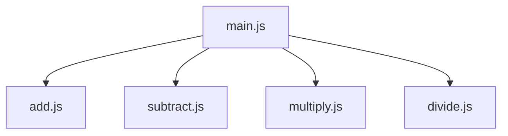
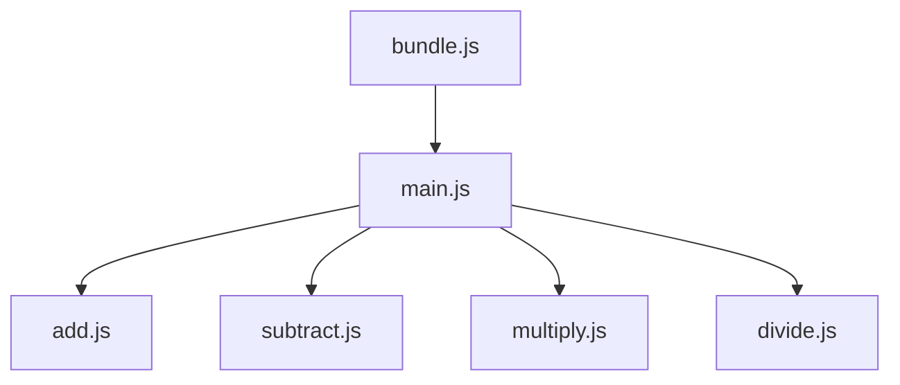

# JavaScript Modularization

模块化方案的演进过程

## 手动模块化（无模块化）

在早期的前端开发中，开发者通常将所有代码放在一个或几个全局脚本中，使用全局变量和函数进行组织。这种方式容易导致代码混乱、难以维护，并且不利于复用。

## 命名空间和对象字面量

为了避免全局污染和组织代码，开发者开始使用命名空间和对象字面量。通过创建一个全局对象，并将相关的函数和变量添加到该对象中，以模拟模块的概念。这种方法提高了代码的可维护性，但仍然有一些限制。

## 立即执行函数和闭包

IIFE 提供了一种在代码中创建作用域的方式，以防止变量污染全局命名空间，并且可以通过参数传递实现一些模块化的特性。

## CJS —— CommonJS

Nodejs 这个 JavaScript Runtime 的横空出世，带来了 Nodejs 自己的模块化解决方案，CommonJS 是一种模块化规范，用于在服务器端和本地环境中实现模块化编程。它主要用于 Node.js 环境。在 Node.js 环境中。它通过 require 和 module.exports 语法来定义和导出模块。虽然在客户端使用 CommonJS 存在一些问题，但它在服务器端的成功启示了后续模块化方案。

## AMD —— Asynchronous Module Definition

AMD 是一种用于 JavaScript 模块化的规范，用于在浏览器环境中实现异步加载模块，引入了 define 函数，允许开发者异步加载模块。

它主要由 RequireJS 等库来支持，RequireJS 是一个流行的 AMD 实现。AMD 使得前端代码能够更灵活地加载和组织模块，提高了性能和可维护性。

## CMD —— Common Module Definition

CMD 是由阿里巴巴前端团队提出的一种模块定义规范，类似于 AMD，但它更强调按需加载模块.CMD 强调的是就近依赖，模块的加载是懒执行的。即模块内部代码执行时，才会去加载依赖的模块。

Sea.js 是一个 CMD 规范的实现

## UMD —— Universal Module Definition

UMD 是一种通用的模块定义规范，可以同时支持 CommonJS、AMD 和全局变量（浏览器环境下的全局对象）的加载方式。它旨在提供跨平台的通用性，适用于各种模块系统。

UMD 的实现通常使用一个立即调用的函数表达式 (IIFE) 来检测模块加载系统，并根据检测结果选择合适的加载方式。

## ESM —— ECMAScript Module

ESM 是 ECMAScript（JavaScript）的官方模块化规范，从 ES6/ES2015 开始引入。它支持静态导入和导出，并成为 JavaScript 开发中的主要模块化标准。

## SystemJS

SystemJS 是一个模块加载器，用于在浏览器中加载不同模块系统定义的模块，包括 AMD、CommonJS、ES6 Modules 等。SystemJS 的目标是提供对各种模块标准的支持，并在开发过程中能够灵活地使用不同的模块系统。

## 参考文章

- [JavaScript Modules: A Beginner’s Guide](https://www.freecodecamp.org/news/javascript-modules-a-beginner-s-guide-783f7d7a5fcc/)
- [What Are CJS, AMD, UMD, ESM, System, and IIFE?](https://betterprogramming.pub/what-are-cjs-amd-umd-esm-system-and-iife-3633a112db62)

- 模块化

  - 提高代码的可维护性：将一个大的程序拆分成多个小模块，每个模块专注于一个功能。这样，代码更加清晰，模块之间相对独立，便于理解和修改
  - 增强代码的复用性：每个模块可以被多个项目复用，而不需要重复编写相同的代码。
  - 避免全局污染：在没有模块化的情况下，所有的代码都放在一个全局作用域中，很容易发生命名冲突，甚至覆盖问题。模块化能够将变量和函数封装在模块内部，防止外部干扰。

- 打包
  - 浏览器对模块的支持有限，早期的浏览器不支持 JS 的模块
  - 合并、压缩和优化资源：通过打包，可以将多个文件合并成一个或多个文件，减少浏览器发起的 HTTP 请求次数，从而加快加载速度等。

怎么样打包的呢？

就是从一个入口文件开始，分析其依赖的模块，然后将其打包成一个或多个文件。

那什么算依赖的模块呢？简单来说，就是被导入（import）的模块。

例如：一个计算器，我们可能需要导入加法模块、减法模块、乘法模块、除法模块等。

```js
// main.js
import { add } from "./add.js";
import { subtract } from "./subtract.js";
import { multiply } from "./multiply.js";
import { divide } from "./divide.js";
```



然后，将这些模块打包成一个文件，这个 main.js 文件就是计算器的入口文件。

最终打包的结果，就可能是一个 bundle.js 文件。里面是五个模块的总代码。


