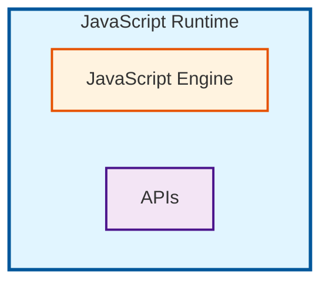

## 编程语言

### 什么是编程语言？

编程语言是人类和计算机沟通的桥梁，人们把自己的想法、意图，通过编程语言来描述，然后输入到计算机中，计算机就可以按照人们的意图来执行。

例如，我想让计算机帮我计算 1 + 1 = 多少，但如果我直接对着它喊，想必是没有任何效果的，而是需要我通过编程语言来描述，然后输入到计算机中，计算机就可以帮我计算出结果。

### 编程语言的一些要素

- 词法（Lexical）
- 语法（Syntax）
- 语义（Semantic）
- 执行方式

#### 词法

它讲的是从 `字符流` 到 `记号（token` 这层的规则

类似英文句子中的一个单词。例如，我们想要在代码中表达一个数字，我们可以使用 `1.1` 来表示，但是如果写了一个 `1.1.1` 这样的数字，那么这个数字就是不合法的，因为词法错误。

- 标识符（identifier）
- 关键字（keyword）
- 字面量（literal）
- 运算符（operator）
- 分隔符/标点（punctuation/separator）
- 注释（comment）
- 空白与行终止（whitespace & line terminator）

#### 语法

类似英文句子中的语法结构。例如，我们想要在代码中表达一个加法运算，我们可以使用 `1 + 1` 来表示，但是如果写了一个 `1 + 1 =` 这样的表达式，那么这个表达式就是不合法的，因为语法错误。

#### 语义

类似英文句子中的含义。例如，我们想要在代码中表达一个加法运算，我们可以使用 `3 + 1` 来表示，但是如果写了一个 `"3" + 1` 这样的表达式，那么在一些语言中，就会发生错误，因为你将一个字符串和一个数字相加，这在数学上是没有意义的。

#### 执行方式

编程语言的执行方式大概有三种：

- 解释型语言
- 编译型语言
- 编译+解释型语言（混合型）

#### 解释型语言

这种类型的编程语言在执行时，需要一个解释器（Interpreter）。

解释器会逐行读取源代码中的语句，边读取边执行。

类似你命令一个懒人帮你打扫房间，你说哪里要打扫，他打扫一步，你不说，他就不打扫。

这种类型的编程语言有这些：Python, JavaScript, Shell, Lua, Ruby, PHP...

| Programming Language | Interpreter                           |
| -------------------- | ------------------------------------- |
| Python               | CPython                               |
| JavaScript           | V8/SpiderMonkey/Hermes/JavaScriptCore |
| Shell                | Bash/Zsh/Fish                         |

#### 编译型语言

这种类型的编程语言在执行时，需要一个编译器（Compiler）。

编译器会一次性将所有的源代码编译成机器可执行的指令，然后直接执行机器可执行的指令。

类似你命令一个勤劳的人帮你打扫房间，你说完，他一次性给你打扫完全部。

这种类型的编程语言有这些：C, C++, Go, Rust, Swift, Kotlin, Objective-C, Dart...

| Programming Language | Compiler        |
| -------------------- | --------------- |
| C                    | GCC/Clang/MSVC  |
| C++                  | GCC/Clang/MSVC  |
| Go                   | Go Compiler     |
| Rust                 | Rust Compiler   |
| Swift                | Swift Compiler  |
| Kotlin               | Kotlin Compiler |
| Objective-C          | Xcode/Clang     |
| Dart                 | Dart Compiler   |

#### 编译+解释型语言（混合型）

混合型的编程语言在执行时，同时需要一个编译器（Compiler）和一个解释器（Interpreter）。

编辑器先把源代码编译成解释器可执行的指令，然后解释器会逐行读取这些指令，边读取边执行。

这种类型的编程语言有这些：Java, C#...

| Programming Language | Compiler | Interpreter |
| -------------------- | -------- | ----------- |
| Java                 | javac    | java        |
| C#                   | csc      | dotnet      |

## 我们要学的编程语言 - JavaScript

### ECMAScript

JavaScript 是一种基于 ECMAScript 规范的实现。它是一种高级、解释性的脚本语言，通常用于在 Web 页面上实现动态交互效果。

ECMAScript is the specification for JavaScript. All versions:

| Version      | Release | Key Features                                                                                                            |
| ------------ | ------- | ----------------------------------------------------------------------------------------------------------------------- |
| ES1          | 1997-06 | First edition standardization (based on JavaScript 1.1)                                                                 |
| ES2          | 1998-06 | Editorial changes to align with ISO/IEC 16262:1998                                                                      |
| ES3          | 1999-12 | Regular expressions, `try...catch`, string/number formatting improvements                                               |
| ES4          | —       | Abandoned; many ideas later incorporated into ES2015+                                                                   |
| ES5          | 2009-12 | Strict mode, native JSON, `Object.defineProperty`, getters/setters                                                      |
| ES5.1        | 2011-06 | Editorial changes to align with ISO/IEC 16262:2011                                                                      |
| ES2015 (ES6) | 2015-06 | `let/const`, classes, modules, arrow functions, template strings, destructuring, `Promise`, generators, `Map/Set`       |
| ES2016       | 2016-06 | Exponentiation operator `**`, `Array.prototype.includes`                                                                |
| ES2017       | 2017-06 | `async/await`, `Object.values/entries`, string padding, trailing commas, shared memory/Atomics                          |
| ES2018       | 2018-06 | Object rest/spread, `Promise.prototype.finally`, async iteration, RegExp enhancements (dotAll, named capture, etc.)     |
| ES2019       | 2019-06 | `Array.prototype.flat/flatMap`, `Object.fromEntries`, `trimStart/trimEnd`, optional `catch` binding                     |
| ES2020       | 2020-06 | BigInt, dynamic `import()`, optional chaining `?.`, nullish coalescing `??`, `Promise.allSettled`, `globalThis`         |
| ES2021       | 2021-06 | Logical assignment (`&&=`, `\|\|=`, `??=`), numeric separators, `String.prototype.replaceAll`, `Promise.any`, WeakRef   |
| ES2022       | 2022-06 | Class fields/private members/methods, static initialization blocks, top-level `await`, `Object.hasOwn`, `.at()`         |
| ES2023       | 2023-06 | Immutable array methods: `toSorted`/`toReversed`/`toSpliced`/`with`, `findLast`/`findLastIndex`, Hashbang syntax `#!`   |
| ES2024       | 2024-06 | `Object.groupBy/Map.groupBy`, `Promise.withResolvers`, Set methods (`union`/`intersection`), RegExp `/v` flag           |
| ES2025       | 2025-06 | Iterator helpers (`map`/`filter`/`take`/`drop`/`toArray`), Import Attributes, JSON modules, `Promise.try`, Float16Array |

### JavaScript Interpreter/ JavaScript Engine

经过上面的了解，我们知道，JavaScript 是一种解释型语言。所以它的执行是需要一个解释器的。而这个解释器，我们通常又会称之为 JavaScript Engine，即 JS 引擎。

现在仍在流行的 JS 引擎有这些：

| JavaScript Engine | Company or Developer |
| ----------------- | -------------------- |
| V8                | Google               |
| SpiderMonkey      | Mozilla              |
| JavaScriptCore    | Apple                |
| QuickJS           | Fabrice Bellard      |
| Duktape           | Sami Vaarala         |
| Hermes            | Facebook             |
| Carakan           | Opera                |
| Chakra            | Microsoft            |

### JavaScript Runtime

如果我们仅仅只是执行 JavaScript 代码，那么我们只需要一个 JavaScript Engine 就可以了。但是，我们往往需要 JavaScript 实现一些其他的功能，例如，我们想要在 JavaScript 代码中访问文件系统，或者创建 TCP/UDP 服务器，或者发送 HTTP 请求等。这个时候，如果仅仅只是一个 JavaScript Engine，那么我们是无法实现这些功能的。

所以，我们会将 JavaScript Engine 和 一些其他的功能集成在一起，形成一个 JavaScript Runtime。

例如，最常见的 JavaScript Runtime 是浏览器，对于浏览器而言，它给 JavaScript 提供了访问 Window 对象，操作 DOM 对象、发送 Ajax 请求等 Web APIs。Nodejs 给其中的 JavaScript 提供了访问文件系统、创建 TCP/UDP 服务器、发送 HTTP 请求等 Node APIs。

| JavaScript Runtime |                  Built-in JavaScript Engines                   |                APIs                 |
| :----------------: | :------------------------------------------------------------: | :---------------------------------: |
|      Browser       | Chrome:V8   Safari:JavaScriptCore   Firefox:SpiderMonkey |    Window、DOM、XMLHttpRequest……    |
|       Nodejs       |                               V8                               |          fs、http、path……           |
|        Deno        |                               V8                               |     File System、I/O、Network……     |
|        Bun         |                         JavaScriptCore                         | File I/O、HTTP Server、WebSockets…… |
