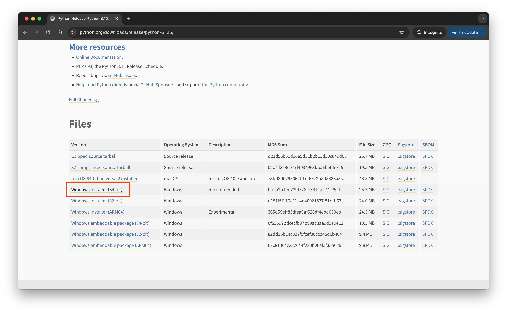

# 环境变量

环境变量（Environment Variables）是操作系统用来存储一些系统级和用户级配置信息的变量。这些变量可以影响系统和应用程序的行为，并且可以在命令行、脚本、应用程序等环境中使用。

## 常见的环境变量

- PATH：指定命令行中查找可执行文件的目录列表。
- HOME（Linux/macOS）或 USERPROFILE（Windows）：指定用户的主目录。
- SHELL（Linux/macOS）：指定当前使用的 shell 程序。
- TEMP/TMP：指定系统临时文件的存放路径。
- USER（Linux/macOS）或 USERNAME（Windows）：当前登录的用户名。
- LANG：指定系统语言和区域设置。

## 环境变量的作用范围

1. 用户级环境变量：只在当前登录的用户会话中生效，只对当前用户有效。
2. 系统级环境变量：对所有用户生效，对所有终端会话有效。

## 增加/修改 环境变量

### 临时增加/修改

1. Linux/macOS：在命令行中输入 export 变量名=值，即可增加或修改环境变量。这只会在当前终端会话中生效。

```shell
export VAR_NAME="value"
```

2. Windows：在命令行中输入 set 变量名=值，即可增加或修改环境变量。这只会在当前命令行会话中生效。

```shell
set VAR_NAME="value"
```

### 永久增加/修改

1. Linux/macOS：编辑 ~/.bash_profile 或 ~/.zshrc 文件，添加环境变量。
2. Windows：可以通过系统属性中的 “环境变量” 设置界面进行配置。

## 耳熟能详的 PATH 环境变量

PATH 环境变量是用来指定操作系统查找命令的二进制可执行文件的目录列表。

1. 搜索目录：当你输入一个命令，操作系统会从 PATH 中的第一个目录开始搜索，直到找到匹配的可执行文件为止。
2. 执行优先级：PATH 中目录的顺序决定了命令的执行优先级。列在前面的目录优先被搜索到，所以如果多个目录中存在同名的可执行文件，系统会运行第一个找到的。
3. 分隔符：PATH 环境变量中的目录列表使用冒号（:）或分号（;）分隔，取决于不同的操作系统。

- Linux/macOS：冒号（:）
- Windows：分号（;）

例如：

```shell
go version
```

执行上述命令时，操作系统会从 PATH 中指定的目录列表中查找 go 命令的 `二进制可执行文件`。如果在第一个目录中找到了 go 命令的可执行文件，则执行该文件。如果找不到，则继续搜索 PATH 中的下一个目录。直到找到为止。如果所有目录都搜索完了，还没有找到匹配的可执行文件，系统会返回一个错误信息，如 “command not found”。

# 安装程序的方式

1. 操作系统自带的包管理器安装
2. 操作系统原生安装包
3. 下载构建好的二进制文件
4. 源码编译安装
5. 容器化安装

## 操作系统自带的包管理器安装

各种操作系统都有自己的包管理器，比如：

- linux: apt（Debian/Ubuntu）, yum, dnf（CentOS/Red Hat）, pacman（Arch Linux）
- macOS: Homebrew, MacPorts
- windows: Chocolatey、Scoop

### linux 举个栗子 🌰

这是在 linux（centos） 系统 上使用 yum 安装 python3

```shell
[root@iZ0jlec10s3a8rm9eafs2vZ ~]# yum install python3
Last metadata expiration check: 1:08:41 ago on Tue 03 Sep 2024 10:50:07 PM CST.
Package python36-3.6.8-2.2.module+al8+7+fc89227e.x86_64 is already installed.
Dependencies resolved.
================================================================================
 Package    Arch     Version                             Repository        Size
================================================================================
Upgrading:
 python36   x86_64   3.6.8-38.module+al8+10+4ba10e20     alinux3-module    19 k

Transaction Summary
================================================================================
Upgrade  1 Package

Total download size: 19 k
Is this ok [y/N]:


```

### macOS 举个栗子 🌰

这是在 macOS 系统 上使用 brew 安装 python

```shell
 ~/ brew install python
==> Downloading https://ghcr.io/v2/homebrew/core/python/3.12/manifests/3.12.5
######################################################################### 100.0%
==> Fetching dependencies for python@3.12: mpdecimal, ca-certificates, openssl@3, readline, sqlite and xz
==> Downloading https://ghcr.io/v2/homebrew/core/mpdecimal/manifests/4.0.0-1
######################################################################### 100.0%
==> Fetching mpdecimal
==> Downloading https://ghcr.io/v2/homebrew/core/mpdecimal/blobs/sha256:2965eec8
######################################################################### 100.0%
==> Downloading https://ghcr.io/v2/homebrew/core/ca-certificates/manifests/2024-
######################################################################### 100.0%
==> Fetching ca-certificates
==> Downloading https://ghcr.io/v2/homebrew/core/ca-certificates/blobs/sha256:73
######################################################################### 100.0%
==> Downloading https://ghcr.io/v2/homebrew/core/openssl/3/manifests/3.3.1-1
^C

```

### windows 举个栗子 🌰

## 操作系统原生安装包

- Windows: .msi, .exe
- macOS: .dmg, .pkg
- linux: .deb (Debian), .rpm（Red Hat）

### windows 举个栗子 🌰

1. exe（executable）：这里会得到 python 的 windows 的 exe 安装程序，.exe 文件是 Windows 平台上最常见的可执行文件格式，用于安装软件、运行程序或执行脚本。通常通过双击运行，安装程序会引导用户完成软件安装的各个步骤。




2. msi（Microsoft Installer）：这里会得到 go 的 windows 的 msi 安装程序，.msi 文件是 Windows Installer 数据库文件，专门用于软件的安装、维护和删除。相比 .exe 文件，.msi 文件结构化地存储了安装信息，适合企业部署和自动化安装。


### macOS 举个栗子 🌰

1. pkg（package）：.pkg 文件是 macOS 上的一种安装包格式，通常用于更复杂的安装过程。它允许分发多文件应用程序，并支持自定义安装路径、脚本执行和权限管理。

2. dmg（disk image）：.dmg 文件是 macOS 平台上的磁盘映像文件，通常用于分发软件。打开 .dmg 文件后，会挂载一个虚拟磁盘，其中通常包含应用程序文件和一个指向 Applications 文件夹的快捷方式，用户可以将应用程序拖动到 Applications 文件夹以完成安装。

### linux 举个栗子 🌰

## 下载构建好的二进制文件

这种是直接下载已经构建好的二进制压缩包，通过解压到指定目录，然后配置环境变量即可使用。

1. 直接下载 go 的二进制包


2. 解压，得到 go 的二进制可执行文件


3. 将 go 的二进制可执行文件所在的目录添加到 PATH 环境变量中


4. 验证 go 是否安装成功

```shell
go version
```


## 源码编译安装

这种就是从源码编译安装，这种需要先安装依赖包，然后进行编译，最后安装到指定目录。这种适合有特殊需求，比如定制化安装的场景。

## 容器化安装

容器化安装是一种将应用程序打包到轻量级容器中，并运行在 Docker 等容器引擎上的一种方式。这种方式可以简化部署过程，同时提供隔离和版本控制的特性。
