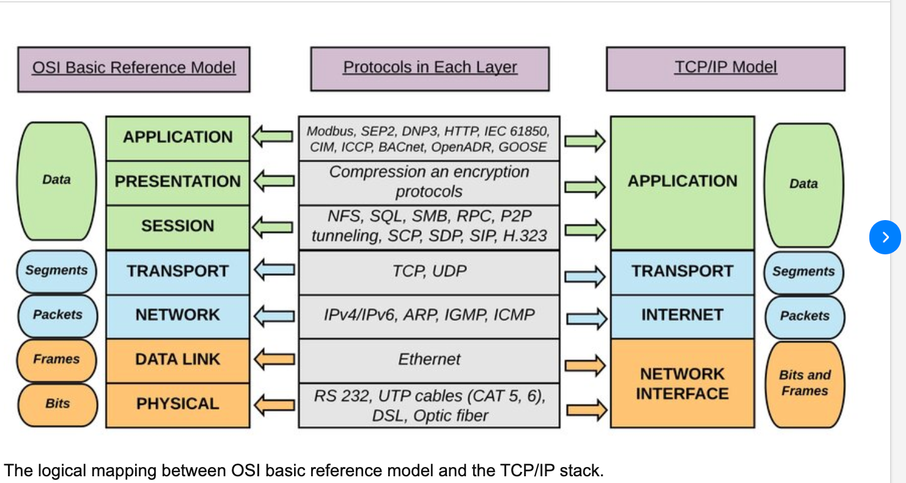
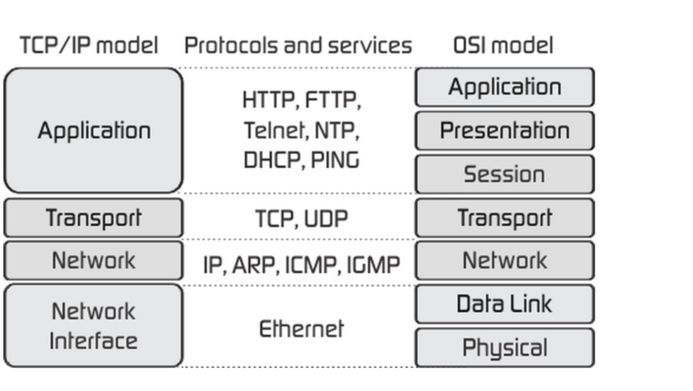

# TCP\IP

| TCP\IP            |                                                                                          |                            |
| ----------------- | ---------------------------------------------------------------------------------------- | -------------------------- |
| Application Layer | HTTP HTTPS SSH FTP SFTP Telnet SMTP IMAP POP3 LDAP PGSQL MSSQL MYSQL MongoDB RDP VNC AFP | DNS TFTP DHCP NTP QUIC RTP |
| Transport Layer   | TCP                                                                                      | UDP                        |
| Network Layer     | IP                                                                                       |
| Link Layer        |                                                                                          |

