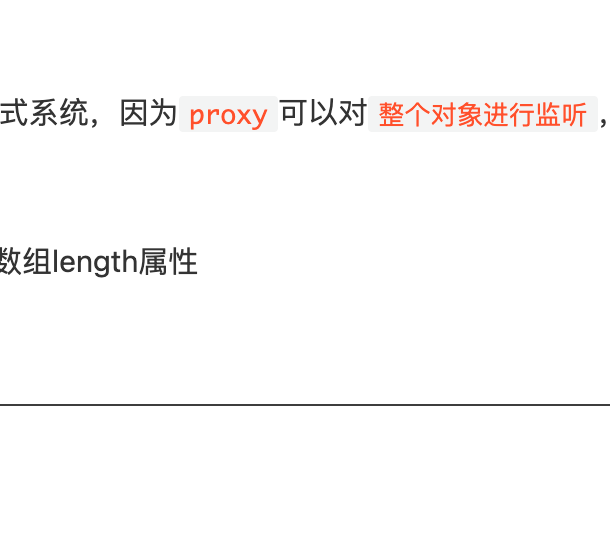

# Clash

假设一个场景，现在亚非要给亚涛传递一个秘密纸条过去

这个纸条的内容是：

- 收纸条的人：亚涛
- 他要传递的信息：亚涛你工资多少

但是现在呢，亚非不能直接把纸条给亚涛（如果直接给过去会被美娜姐发现，然后会把纸条扔掉）

所以，现在亚非的纸条需要经过舒镐和李佳来传递。流程如下：

```js
亚非 -> 舒镐 -> 李佳 -> 亚涛
```

当亚非把纸条给舒镐的时候，舒镐为了不让别人发现这个纸条的内容，就用一个密码小箱子锁着，然后等合适的时候给李佳，因为之前已经跟李佳协商好了，所以李佳也是知道密码箱的密码的。

然后当李佳收到箱子的时候，她解开密码，把纸条传递给了亚涛。

亚涛一看：“哦吼，竟然问我工资，那我不告诉你。”，于是他写了一个回复的纸条。内容如下：

- 收纸条的人：亚非
- 他要传递的信息：你猜

然后李佳也拿了密码箱装起来，传给舒镐，舒镐拿到了，再输入密码解开密码箱，拿到纸条给了亚非。

## 原理

在上面的场景中呢，

- 亚非 就代表了 我们浏览器发起的 HTTP 请求，也就是我们去访问一个网站，例如 chatgpt 的网站。
- 舒镐 就代表了 我们电脑上安装的代理软件，也就是 clash 客户端软件，那个小猫图案的软件
- 美娜姐 就代表了 长城防火墙
- 李佳 就代表了 国外某台服务器上面安装的 clash 服务端软件
- 亚涛 就代表了 我们要访问的网站的服务器，例如 chatgpt 网站所在的服务器

我们一般不能直接访问国外的网站，因为中国这个国家设立的「长城防火墙」，会阻拦访问一些外国网站，例如 youtube，chatgpt、google 等等。

所以我们需要通过代理的方式来掩饰我们的意图。就想上面的场景，亚非想要给亚涛传递纸条，但是直接传过去会被美娜姐劫持，所以，就让舒镐和李佳代理。

那我们的网络请求也是一样，我们先让我们电脑上的客户端代理程序接管所有的浏览器发起的网络请求，然后客户端代理程序（类比舒镐），将你要传输的数据，发送给服务端代理程序（类比李佳），然后服务端代理程序去帮我们访问要访问的网站，同时把我们要访问的数据拿回来。

### 如何让客户端代理程序接管浏览器的网络请求

在 clash 的配置项中，有一个大类叫 inbound，就是告诉 clash，应该接管哪些种类的网络请求

- SOCKS5
- HTTP(S)
- Redirect TCP
- TProxy TCP
- TProxy UDP
- Linux TUN device (Premium only)

```yaml
# Port of HTTP(S) proxy server on the local end
# port: 7890

# Port of SOCKS5 proxy server on the local end
# socks-port: 7891

# HTTP(S) and SOCKS4(A)/SOCKS5 server on the same port
mixed-port: 7890

# Transparent proxy server port for Linux and macOS (Redirect TCP and TProxy UDP)
# redir-port: 7892

# Transparent proxy server port for Linux (TProxy TCP and TProxy UDP)
# tproxy-port: 7893

# Allow clients other than 127.0.0.1 to connect to the inbounds
allow-lan: false
```

例如要接管所有的 HTTP 或 HTTPS 的请求，那配置项就是：

```yaml
port: 7890
```

例如要接管所有的 SOCKS5 的请求，那配置项就是：

```yaml
socks-port: 7891
```

如果都想一起接管，那就可以写成：

```yaml
mixed-port: 7890
```

但是浏览器怎么知道他发的请求是要给客户端代理程序，而不是直接发给要访问的网站的服务端程序呢。这就要设置「系统代理」了，就是告诉浏览器，你以后不能直接给网站的服务端程序（亚涛）发请求了，而是先给客户端代理程序（舒镐）。

clash 软件支持快速设置系统代理，就是一个选项 System Proxy，开启即可。也可以自己去电脑的网络设置里面设置。

### 代理过后的网络请求怎么发送给服务端代理软件呢

意思就是，舒镐怎么知道要给谁，是给李佳还是张雨呢？

在 clash 的配置项中，另一个大类叫 outbound，就是告诉 clash，接管的网络请求应该发给谁。

```yaml
# 这个 proxies 配置项就是用来写要发送的服务端代理程序的，下面有两个，你甚至可以添加更多个，然后每次在发送出去之前选择好要发送给那个就行。服务端代理程序也就是所谓的「节点」，这个节点会帮你去访问网站，然后拿回数据在返回给你的客户端代理软件，客户端代理软件再给你的浏览器。
proxies:
  - name: 'ss1'
    type: ss
    server: server
    port: 443
    cipher: chacha20-ietf-poly1305
    password: 'password'

  - name: 'ss2'
    type: ss
    server: server
    port: 443
    cipher: chacha20-ietf-poly1305
    password: 'password'
    plugin: obfs
    plugin-opts:
      mode: tls
```

但是，还记得上面的密码箱吗。舒镐给李佳纸条的时候，不是直接给的，而是装了一个密码箱，因为如果不装密码箱的话，也会被美娜姐劫持丢掉（美娜姐神通广大）。

而密码箱在网络传输中，就是协议。

在这里支持很多种类的密码箱，即支持很多的协议。例如

- Shadowsocks
- ShadowsocksR
- Vmess
- SOCKS5
- HTTP
- Snell
- Trojan

所以来解释一下上面单个服务端代理程序的配置项

```yaml
- name: 'ss1' # 代表名称，随便写
  type: ss # 代表协议种类 ss = Shadowsocks   ssr = ShadowsocksR   vmess = Vmess
  server: server # 代表服务端代理程序所在的主机Ip地址，或者域名
  port: 443 # 代表服务端代理程序运行时监听的端口号
  cipher: chacha20-ietf-poly1305 # 代表数据传输时候加密的方式
  password: 'password' # 密码
```

### 总结

所以现在我们就能写出一个最简单的 clash 配置文件。

```yaml
# 表示监听着7890端口，同时通过开启系统代理，让所有的http请求被客户端代理程序接管。
port: 7890

# 添加一个服务端代理程序，让被接管的请求发往这里
proxies:
  - name: 'ss1'
    type: ss
    server: 10.10.10.10
    port: 443
    cipher: chacha20-ietf-poly1305
    password: '12345678'
```


# JavaScript中有哪些数据类型
## 值类型
- number
- string
- undefined
- boolean
- null
- symbol
- bigint

## 引用类型
- object
  - array
  - function

# undefined、null的区别

```js
const a = function sayHi () {

}

const a =  () => {
  
}


const obj = {
  "0": 
}


```


## 面向对象语言
对象
- 标识符（唯一）
- 状态
- 行为

### Java
- 地址
- 属性
- 方法

### C++
- 地址
- 成员变量
- 成员函数

### JavaScript
- 地址
- 属性
  - 属性
  - 方法
```js
const a = {
  name: "shuhao",
  eat: function eat () {

  }
}

```

数据属性
访问器属性


